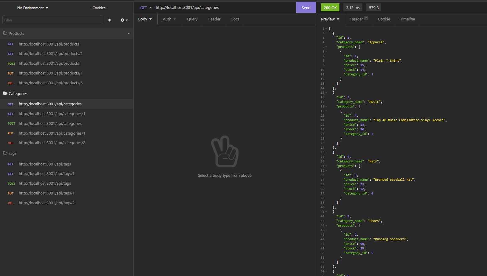
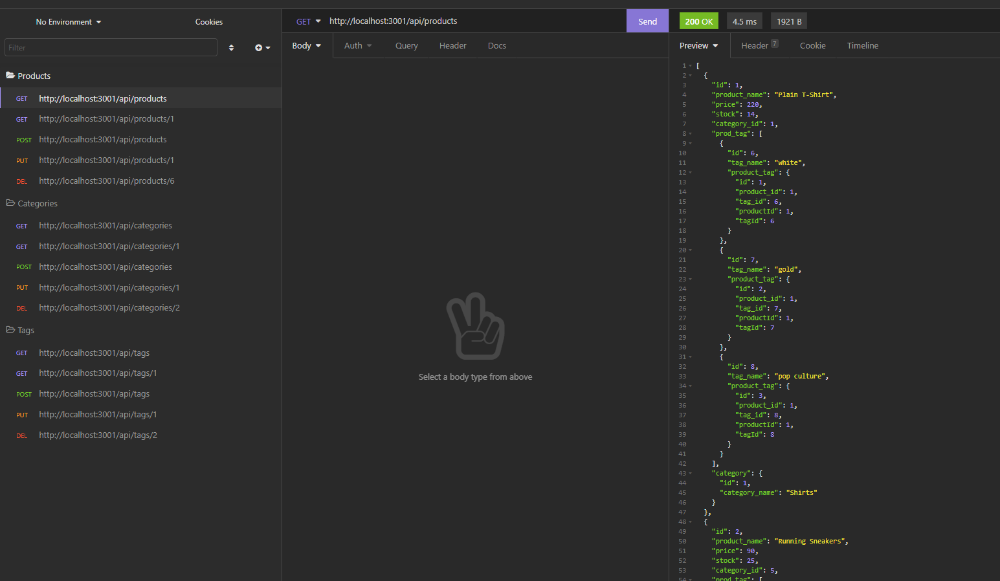
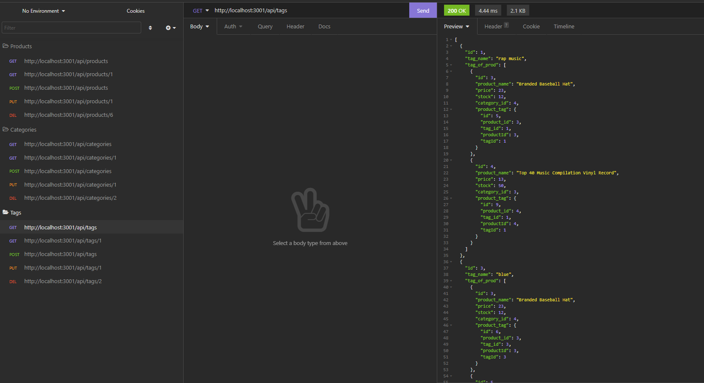

# E Commerce Backend 

## Description

An Express.js API to use Sequelize to interact with a MySQL database.

## Table of contents

- [Installation](#installation)
- [Usage](#usage)
- [License](#license)
- [Questions](#questions)
- [Languages](#languages)
- [Screenshot](#screenshot)
- [Video](#video)

## Installation

From the root dir

install the dependencies: \
`npm i`

## Usage

From the root dir

Create the database in MySQL run: \
`mysql -u root -p`

then: \
`source db/schema.sql `

To see the file: \
`npm run seed`

Start the express server: \
`node server.js`

## License

This is covered under The MIT License:

## Questions

If you have any questions you can contact me on:
jcourtneywork@gmail.com

my github:
https://github.com/jjcourtney/

## Languages

- 
- 
- 
- 
- **`Sequlize.js`**

## Screenshot

## Video

https://drive.google.com/file/d/1Z7Asf2VHQW1Pt4Y5BdpfIyJtnV5ivVUQ/view?usp=sharing
